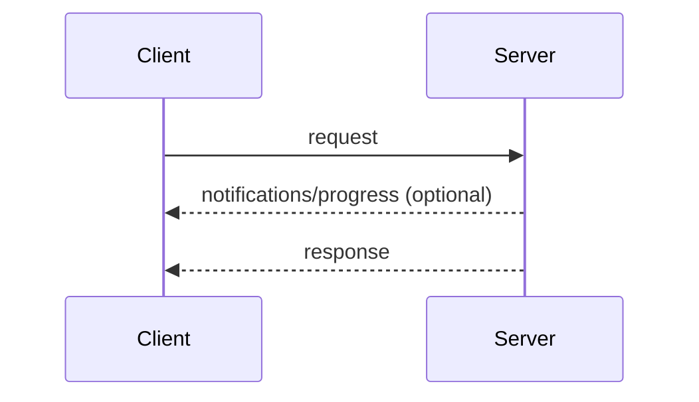
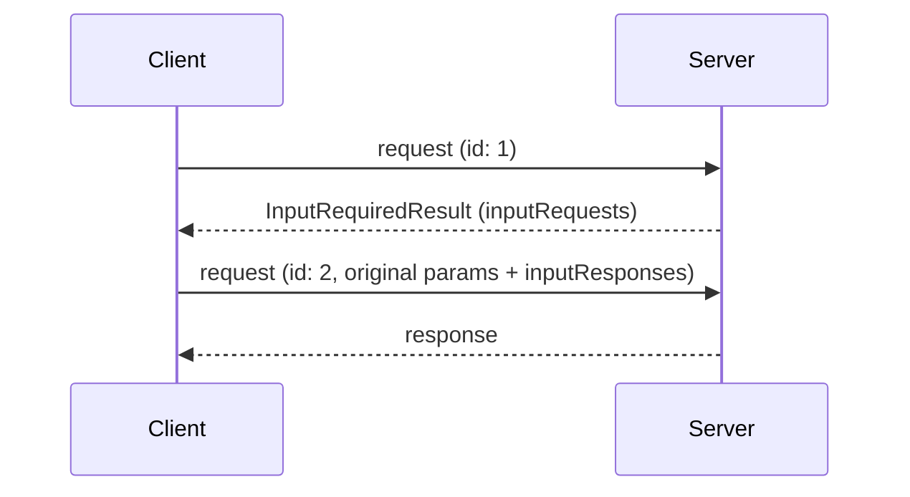
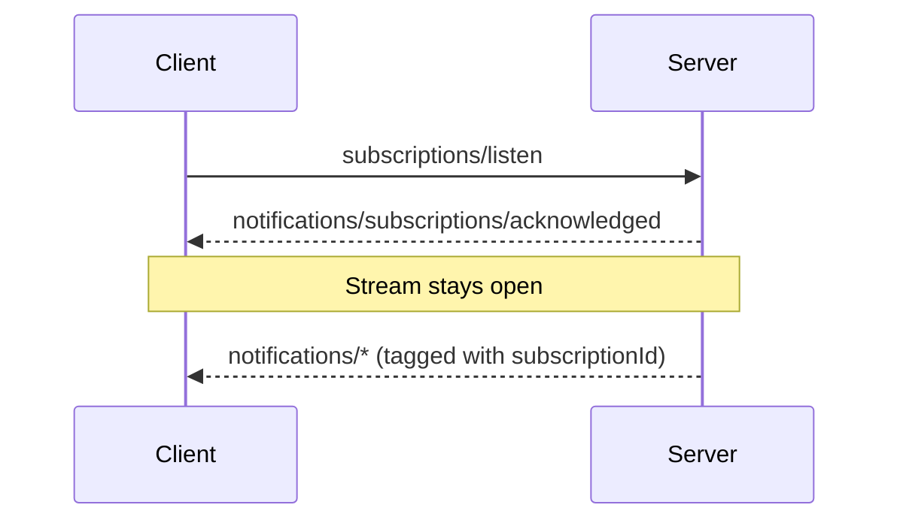

# Index

---
title: Overview
---

This page defines the message patterns of the core protocol: the ways a
client and server compose JSON-RPC
[requests, responses, and notifications](/specification/2026-07-28/basic/index#messages)
into interactions. Every
[transport](/specification/2026-07-28/basic/transports) carries all of these
patterns; transports differ only in how messages are framed and delivered.

Every interaction begins with the client:

- The **client** sends JSON-RPC _requests_ and _notifications_.
- The **server** answers each request with a JSON-RPC _response_ (a result
  or error), optionally preceded by _notifications_ scoped to that request.

Servers **MUST NOT** initiate JSON-RPC requests, and clients do not send
JSON-RPC responses.

## Request and Response

The client sends a request; the server answers it with a result or an error.
While the request is in flight, the server **MAY** send notifications scoped
to it, such as
[`notifications/progress`](/specification/2026-07-28/basic/patterns/progress)
and [`notifications/message`](/specification/2026-07-28/server/utilities/logging).

## Multi Round-Trip Requests

When a server needs client input (sampling, elicitation, or roots) to
complete a request, it answers with an
[`InputRequiredResult`](/specification/2026-07-28/basic/patterns/mrtr#inputrequiredresult)
and the client retries the request with the matching `inputResponses`. See
[Multi Round-Trip Requests](/specification/2026-07-28/basic/patterns/mrtr).

## Subscribe and Notify

To receive change notifications (list changes, resource updates), the client
sends a
[`subscriptions/listen`](/specification/2026-07-28/basic/patterns/subscriptions)
request; the reply is a long-lived stream of the requested notification
types. Stream state is scoped to the request: if the underlying channel is
lost, the client re-issues the request.

## Adding Patterns

All core protocol features are built from these patterns. A protocol
revision that adds a pattern defines it on this page. Transports carry new
patterns without changes, because patterns are expressed entirely in terms
of requests, responses, and notifications.
