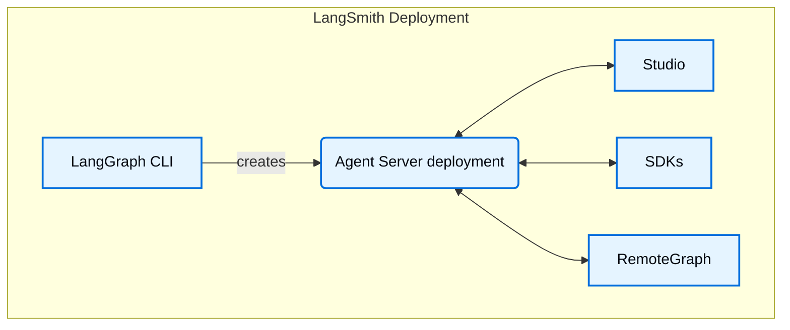

# Components

---
title: LangSmith Deployment components
sidebarTitle: Overview
mode: wide
description: Overview of Agent Server, LangGraph CLI, Studio, SDKs, RemoteGraph, control plane, and data plane components.
---

A [LangSmith Deployment](/langsmith/deployment) installation includes several key components. Together these tools and services provide a complete solution for building, deploying, and managing graphs (including agentic applications), whether on [Cloud](/langsmith/cloud) or in your own [self-hosted](/langsmith/self-hosted) infrastructure:

- [Agent Server](/langsmith/agent-server): Defines an opinionated API and runtime for deploying graphs and agents. Handles execution, state management, and persistence so you can focus on building logic rather than server infrastructure.
- [LangGraph CLI](/langsmith/cli): A command-line interface to build, package, and interact with graphs locally and prepare them for deployment.
- [Studio](/langsmith/studio): A specialized IDE for visualization, interaction, and debugging. Connects to a local Agent Server for developing and testing your graph.
- [Python/JS SDK](/langsmith/reference): The Python/JS SDK provides a programmatic way to interact with deployed graphs and agents from your applications.
- [RemoteGraph](/langsmith/use-remote-graph): Allows you to interact with a deployed graph as though it were running locally.
- [Control Plane](/langsmith/control-plane): The UI and APIs for creating, updating, and managing Agent Server deployments.
- [Data plane](/langsmith/data-plane): The runtime layer that executes your graphs, including Agent Servers, their backing services (PostgreSQL, Redis, etc.), and the listener that reconciles state from the control plane.
